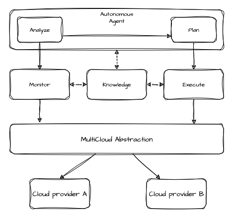
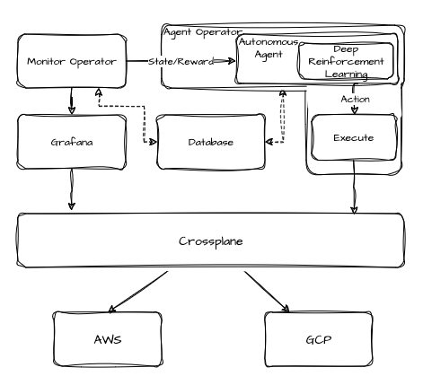

## MultiAtlas: Autonomous management of multi-cloud environments with deep reinforcement learning

This is my PhD research project and the objective is to use DRL and MAPE-K to achieve autonomous capabilities in multi-cloud environments. **It's still in progress.**

The solution consists of three components:

 - The simulation environment: It uses the [CloudSim](https://cloudsimplus.org/) Plus framework to create multi-cloud scenarios. In addition, it uses Py4J to allow access to the simulation environment, which is written using Java, from Python, where the DRL model and the OpenAI GYM environment are developed.
  - The operators: In addition to the simulation environment, MultiAtlas will access real cloud providers and this is done using Kubernetes operators. For the scope of this research, the operators will run on [Crossplane](https://www.crossplane.io/), which is a Kubernetes-based platform for managing cloud environments. MultiAtlas has two Kubernetes operators:
    - Monitoring operator: This is responsible for accessing Grafana's data resources and obtaining the environment's metrics.
    - Autonomous operator: This operator manages components that want to behave autonomously.
- Autonomous agent: This is the main component. It has the deep reinforcement learning model responsible for analyzing the state of the environment and defining actions to be taken.

### General system's architecture:

### Simulation architecture:

### Experimental architecture:

### TODO

#### Simulation:
- Complete the gym environment
- Create a second cloud provider
#### Autonomous agent:
- Complete the DDQN model
- Parameterize the factors to be analyzed
- Write the agent code
#### Operators:
- Create the autonomous operator

